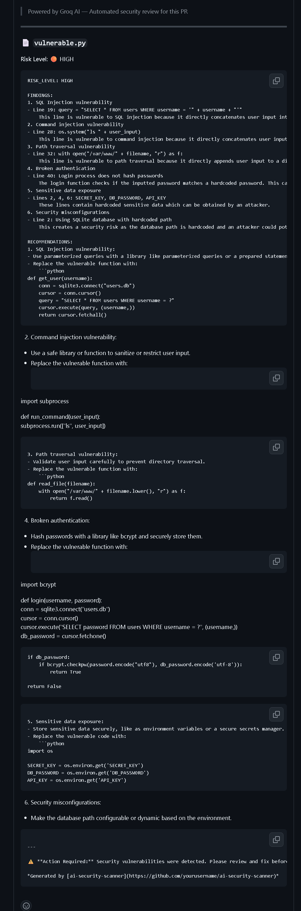

# 🛡️ AI Security Scanner


> **A GitHub Action that automatically scans every Pull Request for OWASP Top 10 security vulnerabilities using AI — and posts a detailed report as a PR comment.**

---

## 🎥 Demo

> Every time a developer opens a PR, this action triggers automatically, analyzes the code, and posts a security report like this:



---

## ⚡ What It Does

Every time someone opens or updates a Pull Request in your repo, this action:

1. 🔍 **Grabs all changed files** from the PR
2. 🤖 **Sends the code to Groq AI** for deep security analysis
3. 🎯 **Checks for OWASP Top 10 flaws** including SQL injection, XSS, hardcoded secrets, command injection, path traversal and more
4. 💬 **Posts a detailed report** as a comment directly on the PR
5. 🚦 **Assigns a risk level** — CRITICAL, HIGH, MEDIUM, LOW, or CLEAN

No manual review needed. No extra tools. Just merge-ready security intelligence on every PR.

---

## 🔍 Vulnerabilities Detected

| # | Vulnerability | Example |
|---|--------------|---------|
| 1 | SQL Injection | `"SELECT * WHERE id = " + userInput` |
| 2 | Cross-Site Scripting (XSS) | `innerHTML = userInput` |
| 3 | Hardcoded Secrets | `API_KEY = "sk-abc123..."` |
| 4 | Command Injection | `os.system("ls " + userInput)` |
| 5 | Path Traversal | `open("/var/www/" + filename)` |
| 6 | Broken Authentication | Plaintext password comparison |
| 7 | Sensitive Data Exposure | Unencrypted PII in logs |
| 8 | Security Misconfiguration | Debug mode in production |
| 9 | Insecure Deserialization | `pickle.loads(userInput)` |
| 10 | Insecure Dependencies | Known vulnerable packages |

---

## 🚀 Setup — Add To Any Repo In 3 Steps

### Step 1 — Add your Groq API key as a secret
Go to your repo → **Settings → Secrets and variables → Actions → New secret**
```
Name:  GROQ_API_KEY
Value: your_groq_api_key_here
```
Get a free API key at [console.groq.com](https://console.groq.com)

### Step 2 — Create the workflow file
Create `.github/workflows/security-scan.yml` in your repo:

```yaml
name: AI Security Scanner

on:
  pull_request:
    types: [opened, synchronize, reopened]

permissions:
  pull-requests: write
  issues: write

jobs:
  security-scan:
    runs-on: ubuntu-latest
    name: Scan PR for OWASP vulnerabilities

    steps:
      - name: Checkout code
        uses: actions/checkout@v4

      - name: Set up Python
        uses: actions/setup-python@v4
        with:
          python-version: '3.11'

      - name: Install dependencies
        run: pip install requests groq

      - name: Run AI Security Scanner
        env:
          INPUT_GROQ-API-KEY: ${{ secrets.GROQ_API_KEY }}
          INPUT_GITHUB-TOKEN: ${{ secrets.GITHUB_TOKEN }}
          GITHUB_REPOSITORY: ${{ github.repository }}
          PR_NUMBER: ${{ github.event.pull_request.number }}
        run: |
          curl -o scanner.py https://raw.githubusercontent.com/tahahahaa/ai-security-scanner/main/scanner.py
          python scanner.py
```

### Step 3 — Open a Pull Request
That's it. The scanner triggers automatically on every PR. 🎉

---

## 📁 Project Structure

```
ai-security-scanner/
├── .github/
│   └── workflows/
│       └── security-scan.yml   ← GitHub Actions workflow
├── scanner.py                  ← Core scanning logic
├── action.yml                  ← Action metadata
├── requirements.txt            ← Dependencies
└── README.md
```

---

## 🧠 How It Works

```
Developer opens PR
       ↓
GitHub Actions triggers automatically
       ↓
scanner.py fetches all changed files via GitHub API
       ↓
Each code file is sent to Groq AI (Llama 3.1)
       ↓
AI analyzes for OWASP Top 10 vulnerabilities
       ↓
Results compiled into a markdown report
       ↓
Report posted as a comment on the PR
       ↓
Developer sees exactly what's vulnerable and how to fix it
```

---

## 🛠️ Tech Stack

| Component | Technology |
|-----------|-----------|
| Automation | GitHub Actions |
| Language | Python 3.11 |
| AI Engine | Groq (Llama 3.1 8B) |
| API Integration | GitHub REST API |
| Security Standard | OWASP Top 10 |

---

## 📊 Sample Output

When a vulnerable file is detected, the PR comment looks like this:

```
🛡️ AI Security Scanner — OWASP Analysis Report

📄 vulnerable.py
Risk Level: 🔴 CRITICAL

FINDINGS:
• SQL Injection on line 12 — user input concatenated directly into query
• Hardcoded API key detected on line 6 — sk-abc123...
• Command injection on line 17 — os.system() with unsanitized input
• Plaintext password comparison on line 23

RECOMMENDATIONS:
• Use parameterized queries instead of string concatenation
• Move secrets to environment variables
• Sanitize all user input before passing to system calls
• Hash passwords using bcrypt or argon2
```

---

## 🗺️ Roadmap

- [ ] Support for more languages (Java, Go, Ruby)
- [ ] Severity threshold — block PR merge on CRITICAL findings
- [ ] Dependency vulnerability scanning via pip audit
- [ ] Custom OWASP rule configuration
- [ ] Slack/Discord notification integration
- [ ] Weekly security summary reports

---

## 🤝 Contributing

Contributions are welcome! Feel free to open a PR or issue.

1. Fork the repo
2. Create a feature branch (`git checkout -b feature/amazing-feature`)
3. Commit your changes (`git commit -m 'Add amazing feature'`)
4. Push to the branch (`git push origin feature/amazing-feature`)
5. Open a Pull Request — and watch the scanner analyze your own code 😄

---

## 👨‍💻 Author

**Muhammad Taha Sheikh**  
Cybersecurity Student | Developer  
🐙 [GitHub](https://github.com/tahahahaa)

---

## ⚠️ Disclaimer

This tool is designed to assist developers in identifying potential security issues. It does not replace a full security audit. Always perform thorough testing before deploying to production.

---

## ⭐ Star this repo if it helped you!

*If this saved you from a security vulnerability, consider giving it a star — it helps others find it too.*
